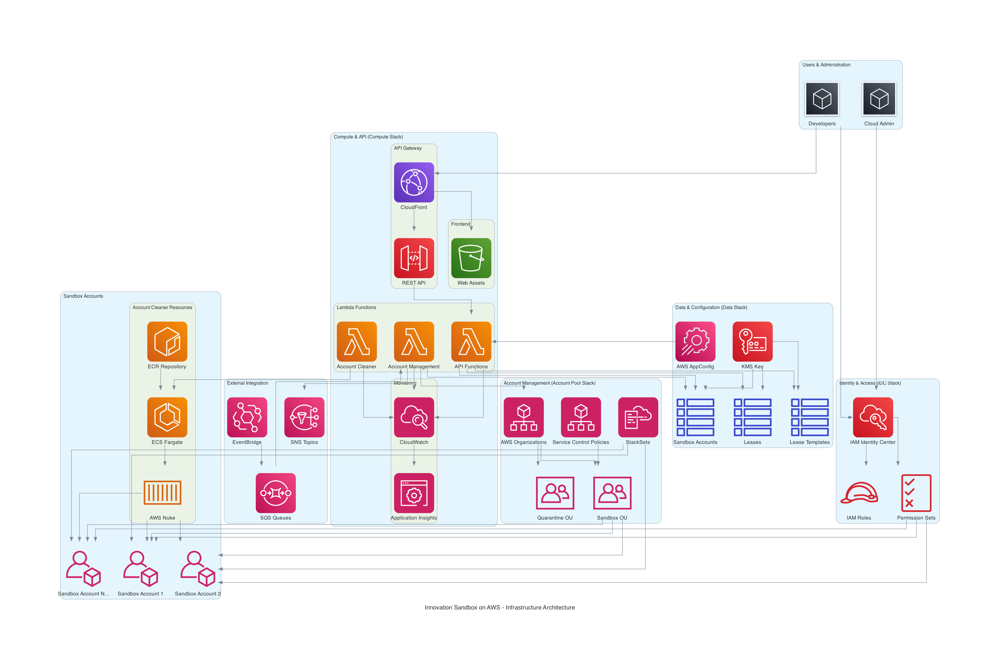

# Innovation Sandbox on AWS - Infrastructure Architecture

## Overview

The Innovation Sandbox on AWS is built using a **multi-stack CDK architecture** with four main CloudFormation stacks that work together to provide a complete sandbox environment management solution. This document provides a comprehensive understanding of the infrastructure components, their relationships, and how they work together.



## Table of Contents

- [Four Core Infrastructure Stacks](#four-core-infrastructure-stacks)
- [Key Infrastructure Components](#key-infrastructure-components)
- [Security & Governance Features](#security--governance-features)
- [Deployment Architecture](#deployment-architecture)
- [Data Flow](#data-flow)
- [Component Details](#component-details)

## Four Core Infrastructure Stacks

### 1. Account Pool Stack (`InnovationSandbox-AccountPool`)

**Purpose**: Manages the pool of AWS accounts and organizational structure

**Key Components**:
- **AWS Organizations**: Creates and manages organizational units (OUs)
- **Service Control Policies (SCPs)**: Enforces security and compliance policies
- **CloudFormation StackSets**: Deploys resources across multiple accounts
- **Account Lifecycle**: Handles account creation, quarantine, and recycling
- **Cross-account Roles**: Sets up necessary IAM roles for account management

**Responsibilities**:
- Create and manage sandbox AWS accounts
- Organize accounts into appropriate OUs (Sandbox OU, Quarantine OU)
- Apply security policies through SCPs
- Deploy baseline resources to all sandbox accounts
- Manage account lifecycle (creation → active → quarantine → recycling)

### 2. Identity & Access Stack (`InnovationSandbox-IDC`)

**Purpose**: Manages user authentication and access control

**Key Components**:
- **IAM Identity Center**: Centralized identity management
- **Permission Sets**: Defines what users can do in sandbox accounts
- **User/Group Management**: Handles user provisioning and access
- **Cross-account Access**: Enables secure access to sandbox accounts

**Responsibilities**:
- Integrate with existing identity providers
- Create and manage permission sets for different user roles
- Provision user access to sandbox accounts
- Handle authentication and authorization flows

### 3. Data Stack (`InnovationSandbox-Data`)

**Purpose**: Provides data storage and configuration management

**Key Components**:
- **DynamoDB Tables**:
  - Sandbox Account metadata (account status, configuration, history)
  - Lease information (who has what account, when it expires)
  - Lease templates (predefined configurations for different use cases)
- **AWS AppConfig**: Centralized configuration management
- **KMS Encryption**: Secures all data at rest
- **Parameter Store**: Shared configuration parameters

**Responsibilities**:
- Store all application state and metadata
- Manage configuration that can be updated without redeployment
- Provide secure, encrypted storage for sensitive data
- Enable cross-stack parameter sharing

### 4. Compute Stack (`InnovationSandbox-Compute`)

**Purpose**: Runs the application logic and user interface

**Key Components**:
- **API Gateway + Lambda**: RESTful API for all operations
- **ALB + S3**: Serves the web application
- **ECS Fargate**: Runs the account cleaning process
- **EventBridge + SQS**: Event-driven architecture
- **CloudWatch**: Monitoring and logging

**Responsibilities**:
- Provide the web interface for users and administrators
- Handle all API requests and business logic
- Execute account cleaning operations
- Process events and notifications
- Monitor system health and performance
## Key Infrastructure Components

### Account Management System

**Account Pool**
- Pre-created AWS accounts ready for immediate use
- Accounts are provisioned in advance to reduce wait times
- Pool size is configurable based on demand

**Organizational Units**
- **Sandbox OU**: Contains active accounts being used by developers
- **Quarantine OU**: Contains accounts that are being cleaned and prepared for reuse
- **Hierarchical Structure**: Enables policy inheritance and management

**Service Control Policies (SCPs)**
- **Innovation Sandbox Protect SCP**: Prevents deletion of critical resources
- **Innovation Sandbox Restrictions SCP**: Limits dangerous or expensive operations
- **Region Limitation SCP**: Restricts resource creation to approved regions
- **AWS Nuke Support SCP**: Ensures account cleaning tools can function
- **Write Protection SCP**: Protects specific resources during cleaning

### Account Cleaning System

**AWS Nuke Integration**
- Open-source tool that systematically removes all resources from AWS accounts
- Containerized for consistent execution across environments
- Configurable to preserve specific resources if needed

**ECS Fargate Execution**
- Serverless container execution for account cleaning
- Scales automatically based on demand
- Isolated execution environment for security

**ECR Repository**
- Stores the AWS Nuke container image
- Supports both public and private repositories
- Version management for different cleaning configurations

**Automated Scheduling**
- Event-driven cleaning based on lease expiration
- Configurable grace periods and notifications
- Retry logic for failed cleaning operations

### Data Layer Architecture

**DynamoDB Tables**
- **Sandbox Account Table**: 
  - Partition Key: `awsAccountId`
  - Stores account metadata, status, configuration
  - Point-in-time recovery enabled
- **Lease Table**: 
  - Tracks who has access to which accounts
  - Lease duration and expiration tracking
  - User and project associations
- **Lease Template Table**: 
  - Predefined configurations for different use cases
  - Template versioning and management
  - Default settings and policies

**AWS AppConfig Integration**
- **Global Configuration**: System-wide settings
- **Nuke Configuration**: Account cleaning parameters
- **Dynamic Updates**: Configuration changes without redeployment
- **Validation**: Built-in configuration validation

**Encryption and Security**
- **Customer-Managed KMS Keys**: Full control over encryption
- **Encryption at Rest**: All DynamoDB tables encrypted
- **Encryption in Transit**: All API communications secured
- **Key Rotation**: Automatic key rotation policies

### API & Frontend Architecture

**REST API Design**
- **Lambda-based Microservices**: Each endpoint is a separate Lambda function
- **API Gateway Integration**: Centralized routing and authentication
- **OpenAPI Specification**: Well-documented API contracts
- **Error Handling**: Consistent error responses and logging

**Frontend Application**
- **React-based SPA**: Modern single-page application
- **Application Load Balancer (ALB)**: Distributes traffic to frontend and API
- **S3 Static Hosting**: Scalable and cost-effective hosting
- **Authentication Integration**: Seamless SSO with Identity Center

**Event-Driven Architecture**
- **EventBridge**: Central event bus for system events
- **SQS Queues**: Reliable message processing
- **Dead Letter Queues**: Error handling and retry logic
- **Lambda Triggers**: Event-driven processing
## Security & Governance Features

### Multi-layered Security

**Service Control Policies (SCPs)**
- Prevent dangerous actions at the organizational level
- Cannot be bypassed by any user or role
- Applied to OUs for consistent policy enforcement
- Examples:
  - Prevent deletion of CloudTrail logs
  - Restrict creation of expensive resources
  - Limit access to specific AWS regions

**IAM Roles and Policies**
- **Least-Privilege Access**: Users get only necessary permissions
- **Cross-Account Roles**: Secure access between accounts
- **Temporary Credentials**: No long-term access keys
- **Role Chaining**: Controlled escalation of privileges

**Encryption Strategy**
- **KMS Customer-Managed Keys**: Full control over encryption keys
- **Encryption at Rest**: All data stored encrypted
- **Encryption in Transit**: All communications secured with TLS
- **Key Rotation**: Automatic rotation of encryption keys

**Network Security**
- **VPC Isolation**: Network-level separation
- **Security Groups**: Granular traffic control
- **Private Subnets**: Internal resources not directly accessible
- **NAT Gateways**: Controlled outbound internet access

### Cost Management

**Budget Controls**
- **Account-Level Budgets**: Automatic spending limits per sandbox
- **Alert Thresholds**: Notifications before limits are reached
- **Automatic Actions**: Account suspension when budgets exceeded
- **Cost Allocation**: Detailed tracking of spending by user/project

**Resource Tagging Strategy**
- **Mandatory Tags**: Required tags for all resources
- **Cost Allocation Tags**: Enable detailed cost reporting
- **Lifecycle Tags**: Track resource age and usage
- **Ownership Tags**: Identify resource owners

**Account Recycling**
- **Prevents Cost Accumulation**: Regular cleanup prevents runaway costs
- **Resource Limits**: SCPs prevent creation of expensive resources
- **Monitoring**: Continuous cost monitoring and alerting
- **Automated Cleanup**: Scheduled resource removal

**Regional Restrictions**
- **Approved Regions Only**: Limits where resources can be created
- **Cost Optimization**: Prevents usage in expensive regions
- **Compliance**: Ensures data residency requirements
- **Simplified Management**: Reduces complexity of multi-region operations

### Compliance & Monitoring

**Audit and Logging**
- **CloudTrail Integration**: Full API call logging
- **Centralized Logging**: All logs aggregated for analysis
- **Log Retention**: Configurable retention periods
- **Compliance Reports**: Automated compliance reporting

**Real-time Monitoring**
- **CloudWatch Metrics**: System performance monitoring
- **Custom Metrics**: Application-specific monitoring
- **Dashboards**: Visual monitoring interfaces
- **Automated Alerting**: Proactive issue detection

**Application Performance**
- **Application Insights**: End-to-end application monitoring
- **Performance Metrics**: Response times and error rates
- **Dependency Mapping**: Understanding system interactions
- **Root Cause Analysis**: Automated problem identification

**Cost Tracking and Reporting**
- **Detailed Cost Reports**: Per-account and per-user cost tracking
- **Budget Variance Reports**: Actual vs. planned spending
- **Trend Analysis**: Historical cost patterns
- **Chargeback Capabilities**: Cost allocation to business units
## Deployment Architecture

The Innovation Sandbox solution supports both **single-account** and **multi-account** deployment patterns to accommodate different organizational needs and security requirements.

### Single-Account Deployment

**Use Cases**:
- Development and testing environments
- Small organizations with simple requirements
- Proof-of-concept implementations
- Cost-conscious deployments

**Architecture**:
- All four stacks deployed to a single AWS account
- Simplified networking and security configuration
- Reduced cross-account complexity
- Lower operational overhead

**Considerations**:
- Limited isolation between components
- Shared resource limits
- Single point of failure
- Less suitable for production workloads

### Multi-Account Deployment (Recommended for Production)

**Account Distribution**:
- **Account Pool Stack** → Organization Management Account
- **IDC Stack** → Identity Center Account (often same as management account)
- **Data Stack** → Hub/Central Account
- **Compute Stack** → Hub/Central Account

**Benefits**:
- **Enhanced Security**: Better isolation between components
- **Improved Governance**: Clear separation of responsibilities
- **Scalability**: Independent scaling of components
- **Compliance**: Meets enterprise security requirements
- **Fault Isolation**: Failures in one account don't affect others

**Cross-Account Communication**:
- **IAM Cross-Account Roles**: Secure service-to-service communication
- **Resource Sharing**: RAM (Resource Access Manager) for shared resources
- **Parameter Sharing**: SSM Parameter Store cross-account access
- **Event Propagation**: EventBridge cross-account event routing

## Data Flow

The Innovation Sandbox follows a well-defined data flow pattern that ensures security, reliability, and performance:

### User Request Flow

1. **User Authentication**
   - User accesses web application via Application Load Balancer (ALB)
   - Authentication handled by IAM Identity Center
   - JWT tokens issued for API access

2. **API Request Processing**
   - ALB → API Gateway → Lambda Functions
   - Request validation and authorization
   - Business logic execution

3. **Data Operations**
   - Lambda functions interact with DynamoDB tables
   - Configuration retrieved from AWS AppConfig
   - All data operations encrypted and logged

### Account Management Flow

1. **Account Request**
   - User requests sandbox account through web interface
   - Request validated against available accounts and user permissions
   - Account assignment recorded in DynamoDB

2. **Account Provisioning**
   - Account moved from pool to active state
   - User permissions provisioned via Identity Center
   - Account configuration applied via StackSets

3. **Account Monitoring**
   - Usage and cost monitoring activated
   - Lease expiration tracking initiated
   - Compliance monitoring enabled

### Account Cleaning Flow

1. **Lease Expiration Detection**
   - EventBridge scheduled rules check for expired leases
   - Notifications sent to users before expiration
   - Grace period handling for extensions

2. **Account Quarantine**
   - Expired accounts moved to Quarantine OU
   - User access revoked immediately
   - Account marked for cleaning

3. **Resource Cleanup**
   - ECS Fargate task launched with AWS Nuke
   - All resources systematically removed
   - Cleanup status monitored and logged

4. **Account Recycling**
   - Cleaned account moved back to available pool
   - Account reset to baseline configuration
   - Ready for next user assignment

### Event-Driven Processing

1. **Event Generation**
   - System events published to EventBridge
   - Custom events for business logic
   - AWS service events integrated

2. **Event Processing**
   - SQS queues buffer events for processing
   - Lambda functions triggered by queue messages
   - Dead letter queues handle failed processing

3. **Notification Delivery**
   - SNS topics for user notifications
   - Email and SMS delivery options
   - Integration with external notification systems

## Component Details

### Lambda Functions

**API Functions**:
- `account-management`: Handle account requests and lifecycle
- `user-management`: User and permission management
- `lease-management`: Lease creation, extension, and termination
- `configuration-management`: System configuration updates

**Background Processing Functions**:
- `account-cleaner-trigger`: Initiates account cleaning process
- `notification-handler`: Processes and sends notifications
- `metrics-collector`: Collects and processes system metrics
- `compliance-checker`: Validates compliance requirements

### DynamoDB Table Schemas

**Sandbox Account Table**:
```
Partition Key: awsAccountId (String)
Attributes:
- accountStatus (String): AVAILABLE, LEASED, QUARANTINE, CLEANING
- currentLeaseId (String): Reference to active lease
- lastCleanedDate (String): ISO timestamp
- accountMetadata (Map): Configuration and tags
- createdDate (String): Account creation timestamp
```

**Lease Table**:
```
Partition Key: leaseId (String)
Attributes:
- awsAccountId (String): Associated account
- userId (String): User who owns the lease
- leaseStartDate (String): Lease start timestamp
- leaseEndDate (String): Lease expiration timestamp
- leaseStatus (String): ACTIVE, EXPIRED, TERMINATED
- projectId (String): Associated project
- budgetLimit (Number): Spending limit
```

**Lease Template Table**:
```
Partition Key: templateId (String)
Attributes:
- templateName (String): Human-readable name
- templateDescription (String): Template purpose
- defaultLeaseDuration (Number): Hours
- budgetLimit (Number): Default spending limit
- allowedServices (List): Permitted AWS services
- requiredTags (Map): Mandatory resource tags
```

This architecture provides a robust, scalable, and secure foundation for managing temporary AWS sandbox environments while maintaining strong governance and cost control.
